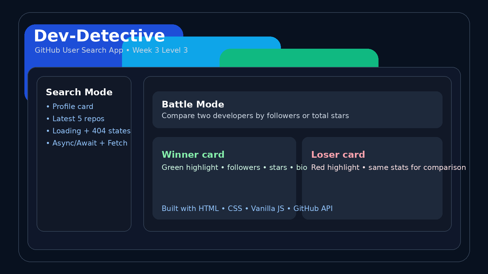

# Dev-Detective

Dev-Detective is my Week 3 internship project for Prodesk IT.

The goal of this project was to practice working with a real API using `fetch()`, `async/await`, JSON data, loading states, and proper error handling in plain JavaScript.

## What this app does

- Search any public GitHub user
- Show profile details like avatar, name, bio, joined date, and portfolio link
- Fetch and display the latest 5 repositories
- Show a proper loading state while the request is in progress
- Handle invalid usernames without crashing the page
- Open repository links in a new tab
- Compare two users in **Battle Mode**
- Compare by **followers** or **total stars**
- Highlight the winner and loser visually

## Tech used

- HTML
- CSS
- Vanilla JavaScript
- GitHub REST API

## Folder structure

```bash
dev-detective-week3/
├── index.html
├── style.css
├── script.js
├── README.md
├── Prompts.md
└── assets/
    └── preview.png
```

## How to run the project

1. Download or clone the repository
2. Open the folder in VS Code
3. Run `index.html` using Live Server

You can also open `index.html` directly in the browser.

## Preview



## Demo points to show

- Search a real user like `octocat`
- Show the loading state
- Show the profile data and latest repositories
- Search a wrong username to show the error message
- Open Battle Mode
- Compare two users by followers
- Compare the same users again by total stars

## Example usernames for testing

- `octocat`
- `torvalds`
- `gaearon`
- `tj`

## Notes

- GitHub API has a rate limit for unauthenticated requests
- If too many requests are made in a short time, the app may show a rate-limit message
- The project is built with plain JavaScript as required in the assignment

## Live link

Add your deployed URL here after hosting:

```txt
Live URL: https://your-project-link.vercel.app
```
